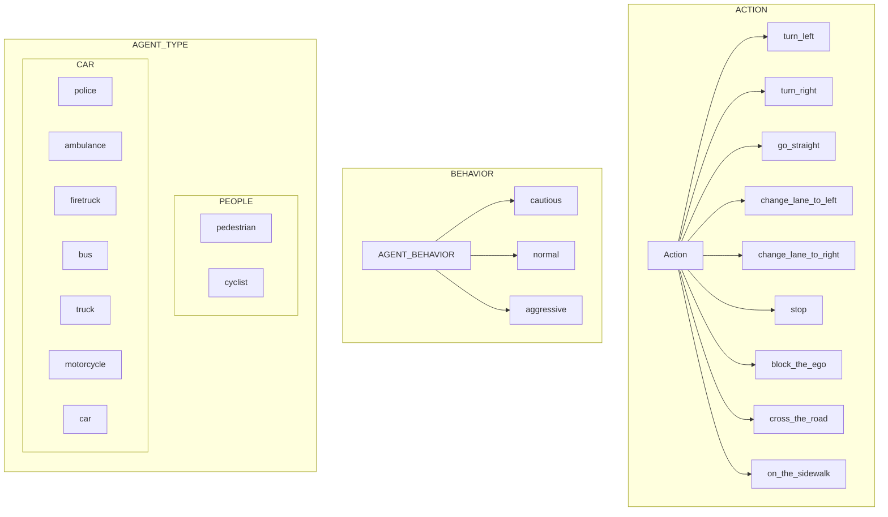

# Environment Details

<!-- ## Control System

- **[Agent](#agent)**
  - [Agent State](#agent-state)
  - [Relative Position](#relative-position)
- **[Scene](#scene)**
  - [WEATHER](#weather)
  - [ROAD TYPE](#road-type)
- **[Example Code](#)** -->

## Agent

Each agent has the following format:

```text
{
  "type": <type>,
  "relative_to_ego": <relative_position>,
  "action": <action>,
}
```

The summary of the available types, relative positions, and actions are as follows:



### Relative Position

Relative position refers to the initial spawning points of the agents with respect to the ego car. The following are the possible relative positions:

| **poisition**      | description                                                                    |
| :----------------- | :----------------------------------------------------------------------------- |
| `front`              | The agent is in front of the ego car                                           |
| `back`               | The agent is behind the ego car                                                |
| `left`               | The agent is on the left side of the ego car                                   |
| `right`              | The agent is on the right side of the ego car                                  |
| `front_left`         | The agent is in front and on the left side of the ego car                      |
| `front_right`        | The agent is in front and on the right side of the ego car                     |
| `back_left `         | The agent is behind and on the left side of the ego car                        |
| `back_right`         | The agent is behind and on the right side of the ego car                       |
| `road_of_left_turn` | The agent is on different roads that ego car should take a left turn to reach  |
| `road_of_right_turn` | The agent is on different roads that ego car should take a right turn to reach |
| `road_of_straight`   | The agent is on different roads that ego car should go straight to reach       |
| `at_the_destination` | The agent is near at the destination of the ego car                            |
| `near_the_crosswalk` | The agent is near at the crosswalk, used for pedestrian                        |

## Scene

### Weather

We support different combination of weathers that is originally defined in the Carla environment.

| Weather Type | Sunset 🌅        | Noon ☀️        | Night 🌖        |
| ------------: | --------------- | ------------- | -------------- |
| Clear     ☀️  | ClearSunset     | ClearNoon     | ClearNight     |
| Cloudy    ☁️  | CloudySunset    | CloudyNoon    | CloudyNight    |
| Wet       🌫️  | WetSunset       | WetNoon       | WetNight       |
| WetCloudy 🌫️  | WetCloudySunset | WetCloudyNoon | WetCloudyNight |
| SoftRain  🌦️  | SoftRainSunset  | SoftRainNoon  | SoftRainNight  |
| MidRain   🌧️  | MidRainSunset   | MidRainyNoon  | MidRainyNight  |
| HardRain  ⛈️  | HardRainSunset  | HardRainNoon  | HardRainNight  |
| DustStorm 🌪️  | -               | DustStorm     | -              |

### Road Type

The agents can be spawned in the following road types:

- **driving**
- **sidewalk**
- **shoulder**
