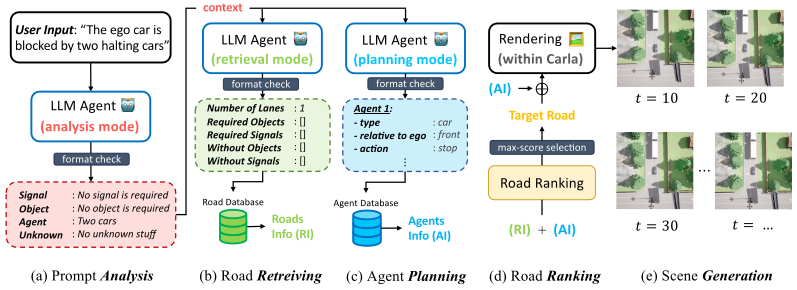

<div id="top" align="center">

# TTSG: Text-to-Traffic-Scene Generation

**A text-to-traffic-scene generation pipeline with the large language model**

<a href="#">"></a>
<a href="#license-and-citation">
  
</a>



</div>

> Bo-Kai Ruan, Hao-Tang Tsui, Yung-Hui Li, Hong-Han Shuai
>
> * Contact: Bo-Kai Ruan
> * [arXiv paper](#) | [Project Website](https://basiclab.github.io/TTSG)


## A. Installation 🚀

First, download Carla from the [official website](https://github.com/carla-simulator/carla/releases). This codebase has been tested with **version 0.9.15**.

```bash
# Update the version number if necessary
conda create --name ttsg python=3.10
conda activate ttsg
conda install pytorch==2.2.2 torchvision==0.17.2 pytorch-cuda=12.1 -c pytorch -c nvidia -y
pip install carla==0.9.15  # Choose your specific Carla version
pip install -r requirements.txt
```

Next, set up your GPT model key. Obtain the API key from [OpenAI](https://platform.openai.com/api-keys) and save it to a .env file:

```bash
OPENAI_API_KEY=your_openai_key
```

## B. Usage 📦

### B-1. Text-to-Scene

This functionality allows users to generate a traffic scene from scratch based on a text prompt. There's no need to manually create an ego vehicle—the scene, including the ego car, will be **generated automatically** 😊.

```bash
# Ensure the Carla server is running before executing this command. If --plan-only is given, no server is needed
python text_to_scene.py \
    --input_text "user's input prompt" \
    --save-dir "path/to/save/recorded/images" \
    --use-cache \
    --return-ego \ # Include this flag if you want the ego car in the output
    --plan-only \ # Use this flag if you only want to plan the scene withour rendering
```

The `use-cache `flag uses a pre-built graph if available in the cache directory; otherwise, it generates a new graph and stores it in the cache. To force a new graph generation, either delete the cache directory or omit the `use-cache` flag.

### B-2. Diversity Test

To conduct the diversity test:

```bash
python misc/evaluate.py --path <path-to-scenarios>
```

Our reported results from the paper are available in the [diversity_test](diversity_test) directory.

To create a custom diversity test, you can use the text-to-scene command mentioned above to generate traffic scenarios.

### B-3. Training and Evaluation on SafeBench

For training and evaluation, we follow the setup of [ChatScene](https://github.com/javyduck/ChatScene/tree/main) on the benchmark of [SafeBench](https://github.com/trust-ai/SafeBench).

```bash
# Training, the scenario_id is range from 1 to 8
python scripts/run_train.py --agent_cfg=adv_text_to_scene.yaml --scenario_cfg=train_agent_text_to_scene.yaml --mode train_agent --scenario_id <scenario_id>

# Evaluation, choose the best epoch for evaluate, using the scenic configuration for fair comparison
python scripts/run_eval.py --agent_cfg=adv_text_to_scene.yaml --scenario_cfg=eval_scenic.yaml --mode eval --scenario_id <scenario_id> --test_epoch <epoch>
```

We provide the following pretrained models:

| Scenario ID | Scenario Name           | Path                                                                                     |
| :---------- | ----------------------- | ---------------------------------------------------------------------------------------- |
| 1           | **Straight Obstacle**   | `safebench/agent/model_ckpt/adv_train/sac/text_to_scene/scenario_1/model.sac.-001.torch` |
| 3           | **Lane Changing**       | `safebench/agent/model_ckpt/adv_train/sac/text_to_scene/scenario_3/model.sac.-001.torch` |
| 6           | **Unprocted Left-turn** | `safebench/agent/model_ckpt/adv_train/sac/text_to_scene/scenario_6/model.sac.-001.torch` |

To use our pretrained models, set the `test_epoch` flag to be `-1`.

## C. Environment 🌍

Detailed information about the environment setup can be found [here](./ENVIRONMENT.md).

## D. Known Issue 🚨

* We have identified an issue with the current Carla version, where a segmentation fault occurs when setting the `pedestrian`’s relative position to `at_the_sidewalk`. This happens when calling the `previous()` function from the Carla API, causing the program to crash. We recommend retrying the process if you encounter this issue.
